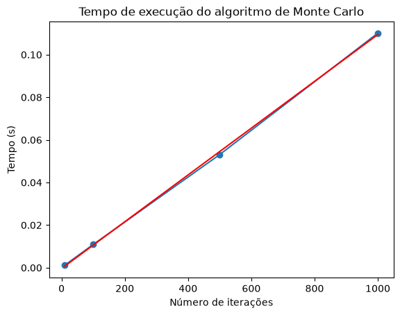
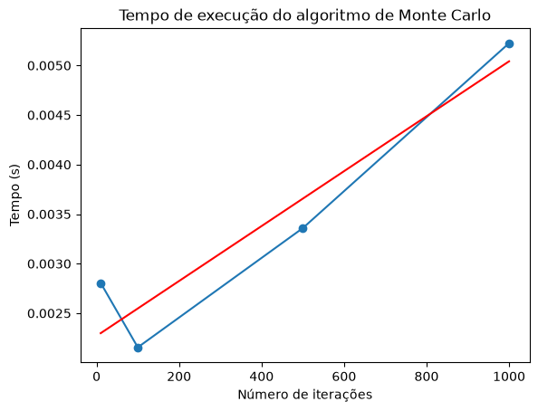
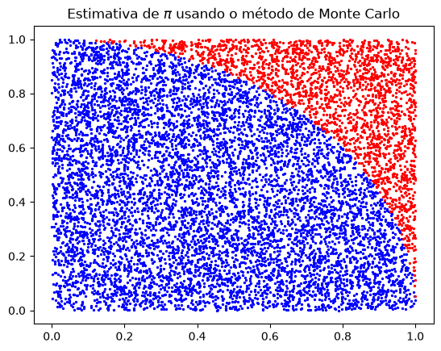
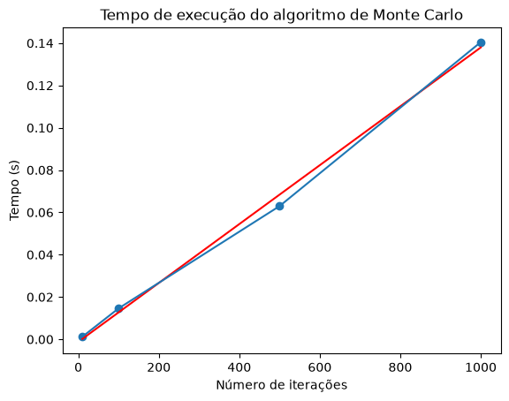
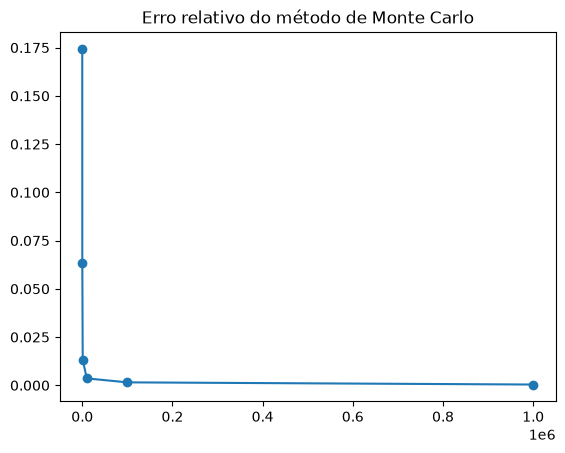
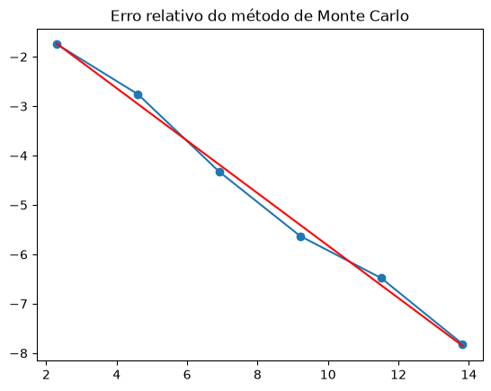
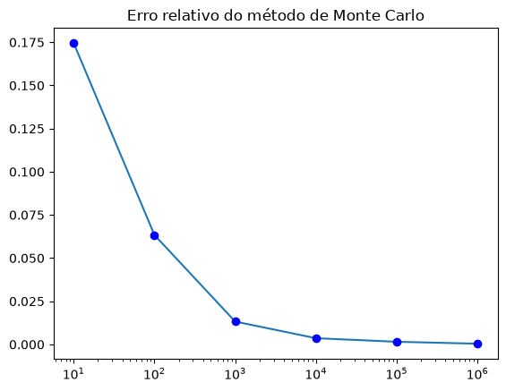

# Física-Computacional-Thiago

## Método De Monte Carlo

- Neste primeiro estudo, foram fundamentados e aplicado os conceitos do Método De Monte Carlo, no qual consiste em uma geração de valores aleatórios em repetição, e mediante essa idéia foi procurado estabelecer uma estimativa do valor de pi.  

Para essa estimativa ser obtida definimos determinadas condições como o raio de uma circunferência, onde todos os pontos menor ou igual ao nosso raio seria um parâmetro para a nossa estimativa, sendo estimativa de $\pi = (4*pontosdentro)/Número de iteracoes$.  

A implementação desse método foi feito de duas formas. A primeira sendo um código lento com a utilização de loops e ifs, Já a segunda maneira sendo o código rápido utilizamos as funções vetoriais da biblioteca numpy assim otimizando o nosso programa.  
  
Assim geramos visualmente a performance de cada algoritmo.

  

Figura 1 : Performance do código lento 

  

Figura 2 : Perfomance do código rápido  

Adiante foi montado uma representação da circunferência com a estimação de pi, com os pontos limitados pelo nosso raio, assim observando a aleatoriedade dos valores dos nossos pares ordenados dentro e fora da nossa circunferência.  

Figura 3 : Estimativa de pi  

Assim gerando o gráfico da performance do nosso código para os pares ordenados  

Figura 4: Performance do Algoritmo para os pares ordenados

Após obter as estimativas de pi foi calculado o erro do valor médio de $\pi$ em função dos números de iterações.  

Onde obtemos os gráficos  

  

Figura 5 : $\pi$ em função do número de iterações  

Figura 6 : log de $\pi$ em função do log do número de iterações  

  

Figura 7 : $\pi$ em função do log do número de iterações  

Desses gráficos, observamos o comportamento dos nossos algoritmos ao longo do tempo e a relação do Erro da estimativa de $\pi$ assim extraindo as respectivas leis de potências.